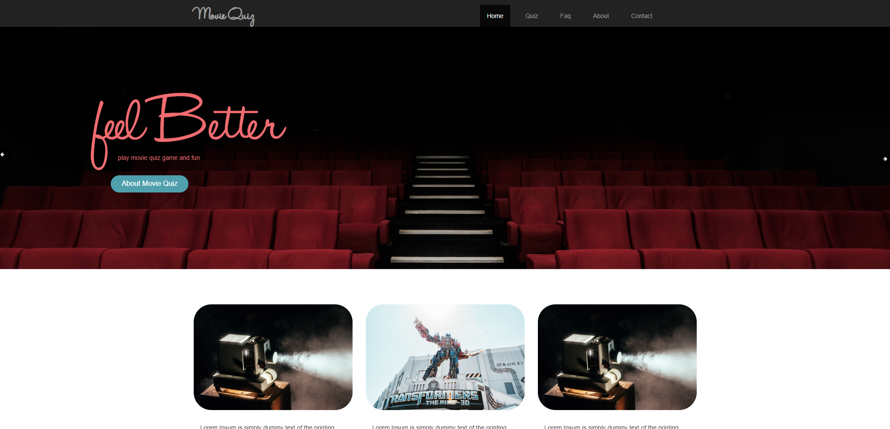
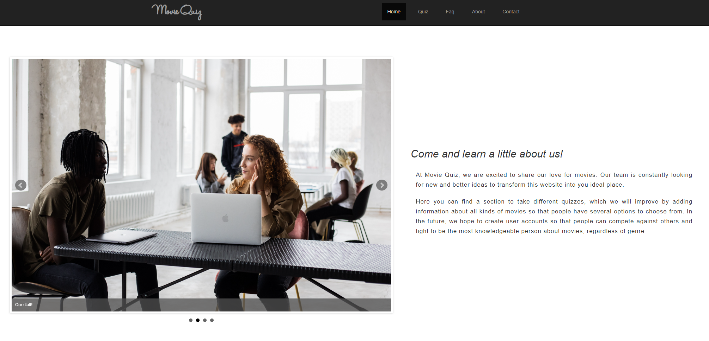
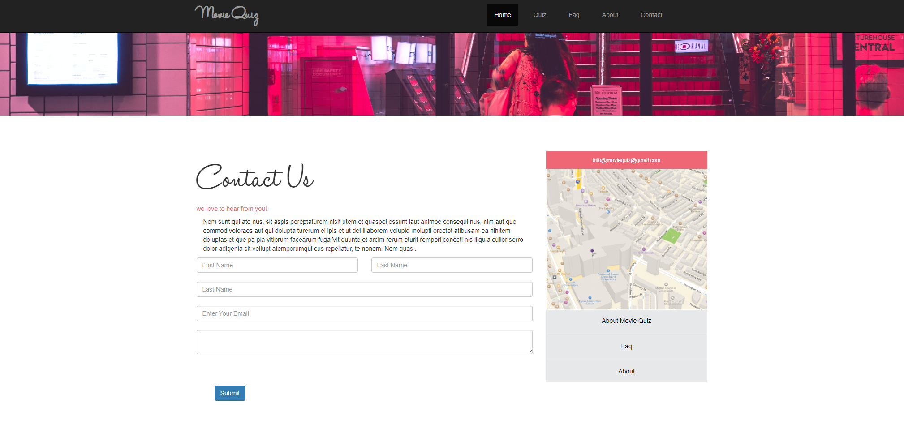

# 🎬 Movie Quiz

## 📌 Project Overview

**Movie Quiz** is an interactive web application designed for movie enthusiasts to test their knowledge. Users can engage in quizzes, explore frequently asked questions (FAQ), and learn more about the creators behind the platform.

This project was developed as a **college final group project**, with contributions from multiple team members. My role in the project was focused on developing the **About Us** section, including both its **HTML and JavaScript** components.

## 🛠 Technologies Used

- **HTML5**: Structure and content of the web pages.
- **CSS3 & Bootstrap**: Styling and responsiveness.
- **JavaScript (ES6+)**: Interactive features.
- **jQuery & Plugins**: bxSlider and Owl Carousel for dynamic UI elements.

## 🚀 Features

- 🏆 **Quiz System**: Users can take a movie-themed quiz and track their scores.
- 📜 **FAQ Section**: Provides answers to common questions about the platform.
- 🏠 **About Us Page**: Introduces the team and the purpose behind the project.
- 📬 **Contact Us Page**: Allows users to reach out for inquiries.
- 🎨 **Responsive Design**: Optimized for various screen sizes.

## 📂 Project Structure

```
📁 movie_quiz_project
 ├── 📄 index.html          # Homepage
 ├── 📁 pages/              # HTML files
 |   ├── 📄 quiz.html           # Movie quiz page
 |   ├── 📄 faq.html            # Frequently Asked Questions (FAQ) page
 |   ├── 📄 about_us.html       # About Us page (My contribution)
 |   ├── 📄 contact_us.html     # Contact page
 ├── 📁 js/                 # JavaScript files
 │   ├── accordion.js       # FAQ functionality
 │   ├── about_us.js        # About Us interactivity (My contribution)
 │   ├── bx_slider_images.js # Image slider functionality
 │   ├── quiz.js            # Quiz logic
 │   ├── owl.carousel.min.js # Carousel library
 │   ├── jquery.bxslider.min.js # Image slider plugin
 ├── 📁 css/                # Stylesheets
 ├── 📁 images/             # Image assets
```

## 📌 Prerequisites

Before running the project, ensure you have:
- A modern web browser (Chrome, Firefox, Edge, etc.).
- Internet access to load external libraries (Bootstrap, jQuery).

## 🏃‍♂️ How to Run

1️⃣ Clone or download the project repository.

```sh
git clone https://github.com/your-repository/movie-quiz.git
```

2️⃣ Open `index.html` in a web browser.

3️⃣ Navigate through the website using the navigation bar.

## 🎯 My Contribution

I was responsible for implementing the **About Us** section, including:
- **Developing the HTML structure** (`about_us.html`).
- **Implementing interactivity in JavaScript** (`about_us.js`).
- **Ensuring a responsive and visually appealing layout**.
- **Integrating an image slider using bxSlider**.

## 🖼️ Screenshots

| Home | About Us | Contact Us |
|------------|---------|------------|
|  |  |  |

## 📜 License

This project was developed for educational purposes as part of a **college final project**.

---

## 💼 Author

👤 **Juan Jacobo Florez Monroy**  
🌐 **Portfolio**: [jjacobo95.com](https://jjacobo95.com)  
🐙 **GitHub**: [github.com/jjacoboflorez95](https://github.com/jjacoboflorez95)